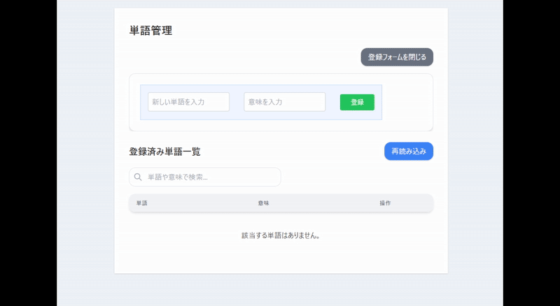
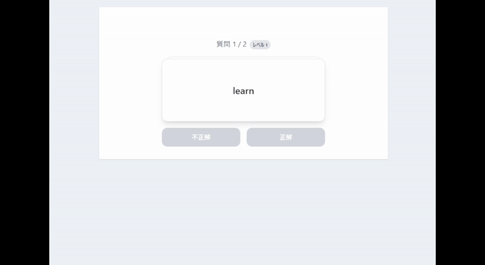
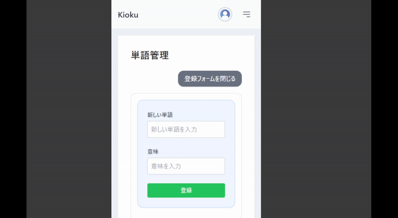
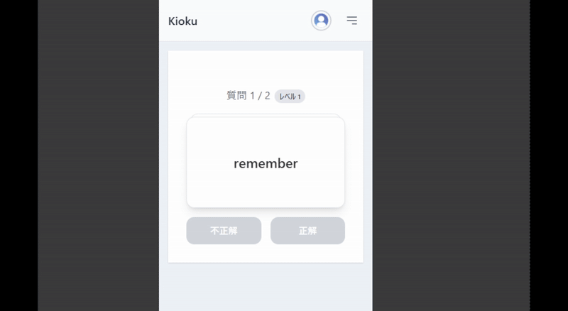

# Kioku - 単語学習アプリ

**科学的アプローチで記憶効率を最大化する、単語学習アプリ**

## アプリケーションの動作デモ
以下は、実際の単語管理画面の操作デモです。直感的なUIで、素早く単語の登録・編集・削除ができます。
### PC用


### スマートフォン用



# アクセスURL
https://impierrot.click/

## 概要 (Overview)

**課題:** 多くの単語学習は「登録して終わり」になりがちで、効率的な復習が難しいという課題があります。覚えたい単語が増えるほど復習時間は膨大になり、やがて学習が続かなくなってしまう...。誰もがそんな経験をしたことがあるのではないでしょうか。

**解決策:** `Kioku`は、心理学の**忘却曲線理論**に基づき、あなたが単語を忘れそうになる「最も効果的なタイミング」を計算。ユーザーは「いつ、何を復習すればいいか」を考える必要は一切ありません。毎日アプリを開き、正答率の低い単語から優先的に提示されるカードで学習するだけで、あなたの知識は確実に長期記憶として定着します。
通勤中のスマートフォン学習で、単語だけでなく、資格試験の用語や歴史の年号など、"覚えたいもの"は何でも効率的にマスターできます。

## 主な機能 (Features)

-   **ユーザー認証**
    -   メール/パスワードによる安全な新規登録（メールによるアカウント有効化フロー）
    -   JWT (Bearerトークン) を利用したセキュアなセッション管理
    -   Googleアカウントによる簡単で安全なソーシャルログイン (OAuth 2.0)
    -   メールによるパスワードリセット機能
-   **単語管理 (CRUD)**
    -   直感的なUIでの単語の登録・一覧表示・編集・削除機能
    -   リアルタイムのインクリメンタルサーチと、項目ごとのソート機能
-   **フラッシュカード学習**
    -   忘却曲線に基づく、パーソナライズされた復習スケジューリング
    -   解答結果（正解/不正解）に応じて、出題する単語を自動選択
    -   スムーズなアニメーションによる快適な学習体験

## インフラ構成図
（記載予定）

## 技術スタック (Tech Stack)
-   **バックエンド**:
    -   **言語**: Go (1.22)
    -   **フレームワーク**: なし
    -   **ORM**: GORM
    -   **データベース**: PostgreSQL
    -   **認証**: jwt, oauth2（ソーシャルログイン）
    -   **設定管理**: `spf13/viper`
    -   **ロギング**: `log/slog`, `lmittmann/tint` (開発時)
    -   **テスト**: `testing` (標準), `stretchr/testify`, `vektra/mockery`
-   **フロントエンド**:
    -   **言語**: TypeScript
    -   **フレームワーク**: React (18), Vite
    -   **ルーティング**: React Router
    -   **API通信**: Axios
    -   **状態管理**: React Context API
    -   **UI**: Tailwind CSS
-   **インフラストラクチャ（バックエンド）**:
    -   **コンテナ**: Docker
    -   **クラウド**: AWS
        -   **ホスティング**: ECS (Fargate), ALB
        -   **データベース**: RDS (PostgreSQL)
        -   **DNS & SSL**: Route 53, ACM (AWS Certificate Manager)
        -   **メール送信**: SES (Simple Email Service)
    -   **IaC**: Terraform
-   **インフラストラクチャ（フロントエンド）**:
    -   **コンテナ**: Docker
    -   **クラウド**: AWS
        -   **ホスティング**: S3, CloudFront
        -   **DNS & SSL**: Route 53, ACM (AWS Certificate Manager)
    -   **IaC**: Terraform
-   **CI/CD**:
    -   GitHub Actions

## アーキテクチャと設計のこだわり

本プロジェクトは、単に機能を実装するだけでなく、保守性、拡張性、テスト容易性を考慮した設計を重視しています。

### バックエンド

<!-- -   **クリーンアーキテクチャ**: アプリケーションを「ドメイン層」「アプリケーション層」「アダプター層」「インフラ層」に分割。依存性のルールを徹底し、ビジネスロジックをフレームワークやDBから保護しています。 -->
-   **依存性逆転の原則 (DIP) & DI**: `Mailer` や各 `Repository` をインターフェースとして定義し、具体的な実装を `main.go` で注入（DI）しています。これにより、コンポーネントが疎結合になり、ユニットテストでモックを簡単に差し替えられる設計を実現しました。
    -   *例: メール送信機能を、ローカルのMailHogから本番のAWS SESへ、設定ファイルの変更のみで切り替え可能。*
-   **構造化ロギング**: `slog` と自作のロガーミドルウェアを導入。全てのリクエストに一意の `req_id` を付与し、ログのトレーサビリティを確保しています。また、本番環境ではCloudWatchでログを管理し、トレーサビリティを向上しています。
-   **階層的な設定管理**: `Viper` を活用し、「デフォルトconfigファイル → 環境ごとのconfigファイル → 環境変数」の順で設定を上書きすることで、柔軟性とセキュリティを両立させています。
-   **テストコードの導入**: stretchr/testify と vektra/mockery を用いて、DBアクセスを伴うリポジトリ層をモック化し、ロジックの純粋なテストを実現しました。

### フロントエンド

-   **API層の分離**: `axios` インスタンスとAPIエンドポイント関数を `api/` ディレクトリに集約。リクエストインターセプターによるJWTの自動付与や、レスポンスインターセプターによる認証エラー（401）の共通ハンドリングを実装しています。
-   **グローバルな状態管理**: `Context API` を用い、アプリケーション全体の認証状態を一元管理。ページリロード時にも `/auth/me` エンドポイントを叩いて認証状態を復元し、シームレスなUXを提供します。
-   **コンポーネント設計**: `pages`, `components`, `hooks`, `types` など、責務に応じたディレクトリ構成で、プロジェクトの見通しを良くしています。

### 共通
- **CDの整備**: `GitHub Actions`を用い、masterブランチへマージをトリガーとして自動デプロイを実装。保守性を向上しています。
- **IaC (Infrastructure as Code) の導入**: `Terraform`にインフラの構築手順をすべて記載。利用するときだけ環境を構築することで費用を抑えています。
- **ローカル開発環境の整備**: `Devcontainer`を導入。開発環境の構築と環境差異を最小限に抑え、チーム開発時の生産性を向上します。
- **Git Flowによる体系的なブランチ運用**: 新機能は feature、緊急のバグ修正は hotfix ブランチで開発するなど、`Git Flow`のワークフローを採用しています。これにより、進行中の開発（develop）と本番（master）の安定性を完全に分離し、安全かつ並行して開発を進められる体制を構築しました。

# ブランチ運用
- 本番用ブランチ: master
- 検証用ブランチ（現在は検証環境はなし）: develop

## ローカルでの実行方法

1.  **前提条件**:
    -   Docker
    -   VSCode

2.  **リポジトリのクローン**:
    -   フロントエンド
    ```bash
    git clone https://github.com/ryory2/react_4_vocabulary_notebook_app_ver_2.git
    ```
    -   バックエンド
    ```bash
    git clone https://github.com/ryory2/go_4_vocab_keep.git
    ```

3.  **環境設定**:
    *   `.env.example` をコピーして `.env` を作成します。
    *   `configs/config.development.yaml.example` をコピーして `configs/config.development.yaml` を作成します。
    *   `config.development.yaml` と `.env` に、Google Cloud Consoleで取得した開発用の**クライアントID**と**クライアントシークレット**を設定してください。

4.  **アプリケーションの起動**:
    1. VSCodeでプロジェクトを開く
    2. 「 Ctrl + Shift + p 」を押下
    3. 「開発コンテナー: キャッシュなしのコンテナのリビルド」

5.  **アクセス**:
    *   **フロントエンド**: [http://localhost:3000](http://localhost:3000)
    *   **バックエンド**: [http://localhost:8080](http://localhost:8080)
    *   **ダミーメールサーバー (MailHog)**: [http://localhost:8025](http://localhost:8025)
    *   **pgAdmin (DB管理ツール)**: [http://localhost:8081](http://localhost:8081)

## APIエンドポイント一覧 (一部)

| Method | Path | 説明 | 認証 |
|:--- |:--- |:--- |:--- |
| `POST` | `/api/v1/register` | 新規ユーザー登録 | 不要 |
| `POST` | `/api/v1/login` | メール/パスワードでログイン | 不要 |
| `POST` | `/api/v1/auth/google/callback` | Googleソーシャルログイン | 不要 |
| `GET` | `/api/v1/verify-email` | メールアドレスの有効化 | 不要 |
| `GET` | `/api/v1/auth/me` | 自身のユーザー情報取得 | **必要** |
| `GET` | `/api/v1/words` | 登録済み単語の一覧取得 | **必要** |
| `GET` | `/api/v1/reviews` | 復習対象の単語一覧取得 | **必要** |


